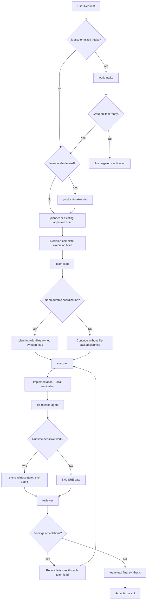

# Opencode Delivery Core Export

This directory is a GitHub-ready export pack for a focused agentic delivery workflow. It is meant to be copied into `~/.config/opencode/` as a portable starting point, not treated as a snapshot of one developer's machine-local runtime state.

The pack is intentionally narrow:

- it includes a delivery pipeline built around `team-lead`, `planner`, `executor`, `qa-release-agent`, `reviewer`, and optional `sre-agent`
- it includes only the commands, references, and skills that directly support that pipeline
- it excludes personal infrastructure, machine-local credentials, and stack-specific specialist agents

## What This Pack Is

- a portable core profile for disciplined software delivery
- a starting configuration that can be customized for your model provider and permissions
- a documented workflow that handles messy intake, execution planning, implementation, QA, review, and optional runtime readiness

## What This Pack Is Not

- a complete personal profile mirror
- a machine-local auth or token bundle
- a stack-opinionated starter for one language or framework
- a replacement for repository-specific docs, contracts, or architecture decisions

## Included Layout

```text
export/
├── .config/opencode/
│   ├── AGENTS.md
│   ├── opencode.json
│   ├── agents/
│   ├── commands/
│   ├── reference/
│   └── skills/
├── ATTRIBUTION.md
├── README.md
└── update.sh
```

## Installation

1. Copy `.config/opencode/` to `~/.config/opencode/`.
2. Open [opencode.settings.json](.config/opencode/opencode.settings.json) and copy the necessary properties into your existing `~/.config/opencode/opencode.json` file.
3. Review the included agents, commands, references, and skills before first use.

This export does not ship credentials, tokens, or personal proxy settings. You must supply your own provider configuration.

## Global Behavior

The pack includes a minimal global [AGENTS.md](.config/opencode/AGENTS.md) that applies caveman-style terse response behavior and nothing else. It does not include repository discovery policy, onboarding rules, or other repo-specific guidance.

## How To Use It

Start with `work-intake` when the user gives you a messy blob of notes, mixed defects, partial requirements, or a bundle of unrelated asks. That command decomposes the blob into grouped work items and routes each group into the pipeline.

Go straight to `team-lead` when the task is already clear and you want disciplined execution without the intake step.

Use `planner-to-team-handoff` when you explicitly want a formal execution brief before implementation starts.

Use `sre-readiness-gate` only when the work is runtime-sensitive: deploy flow, infrastructure, configuration, health checks, rollout safety, rollback, or operational visibility.

## Pipeline Responsibilities

### `team-lead`

`team-lead` owns coordination, stage transitions, escalation handling, and final acceptance. It ensures execution follows an approved brief, that QA happens before signoff, and that reviewer findings are reconciled before the work is treated as complete.

### `planner`

`planner` turns a task into a decision-complete execution brief. It defines scope, non-goals, constraints, verification expectations, and escalation conditions before implementation begins.

### `executor`

`executor` implements the approved brief. It is expected to keep diffs minimal, verify the result, and escalate when repository reality conflicts with the brief.

### `qa-release-agent`

`qa-release-agent` builds and runs a risk-based verification plan. It focuses on executed checks, regression exposure, findings, and release readiness.

### `reviewer`

`reviewer` is a separate audit pass. It looks for correctness issues, regression risk, governance drift, and deviations from the brief. Keeping this separate from QA is deliberate:

- QA is strongest when planning and executing validation
- review is strongest when auditing the result after implementation and QA have already produced evidence
- separating them reduces role blur and makes it easier to detect both testing gaps and contract drift

### `sre-agent`

`sre-agent` is optional. It exists for runtime-sensitive work where rollout safety, observability, configuration, health checks, or rollback risk materially affect readiness.

## Included Commands

- `work-intake`
  Front door for messy or mixed requests.
- `planner-to-team-handoff`
  Brief-first path for larger or higher-discipline execution.
- `product-intake-brief`
  Lightweight problem framing when intent is underdefined.
- `qa-release-gate`
  Explicit QA release pass.
- `sre-readiness-gate`
  Optional runtime-readiness pass.

## Included Skills

- `caveman`
  Persistent terse communication mode that cuts token usage.
- `caveman-help`
  Quick reference for caveman modes and related commands.
- `caveman-review`
  Terse, high-signal review comment style.
- `caveman-commit`
  Terse conventional commit message generation.
- `planning-with-files`
  File-backed planning and resumable progress tracking for long or multi-stage work.
- `operability-readiness`
  Portable runtime-readiness guidance for deploy- or runtime-sensitive changes.
- `logging-guidance`
  Portable structured logging guidance.

## How `planning-with-files` Fits

`planning-with-files` is included because the pipeline benefits from durable coordination when work gets large, multi-session, or dependency-heavy. It is not mandatory for every task.

Ownership model:

- `planner` may use it before handoff for long intake or brief drafting
- `team-lead` is the default owner once work enters coordinated execution
- concurrent use by both roles on the same task should be avoided unless the skill is redesigned for namespaced files

Use it when you need durable task state. Skip it for short, single-clear-task runs.

## Full Workflow Diagram



## Suggested Operating Pattern

1. Start with `work-intake` if the request is messy or mixed.
2. Use `product-intake-brief` only when user/problem/outcome is still underdefined.
3. Have `planner` produce the execution brief.
4. Hand execution to `team-lead`, which coordinates `executor`, `qa-release-agent`, `reviewer`, and optional `sre-agent`.
5. Treat the approved brief, QA results, reviewer findings, and residual risks as the basis for final acceptance.

## Runtime Config Customization

The included [opencode.settings.json](.config/opencode/opencode.settings.json) is a sanitized group of settings, not a ready-to-run personal profile.  It is made to have its pieces copy/pasted into your *real* opencode.json file.  It isn't named `opencode.json` in case you accidentally copy this repo over your existing stuff - at least you won't lose your model setup and any custom opencode configs if you do.

You may also want to adjust:

- `default_agent`
- bash permission rules
- edit permission defaults
- skill permission defaults

The config intentionally keeps:

- `instructions` pointing at `~/.config/opencode/reference/tooling.md`
- `default_agent` set to `team-lead`
- only the included pipeline skills whitelisted in `permission.skill`

## Validation Checklist

After copying or modifying the pack, run:

```bash
jq empty .config/opencode/opencode.settings.json
bash -n export/update.sh
rg -n "backend-python-agent|frontend-react-agent|db-postgres-agent|sqlalchemy-alembic|orm-contract-tests|team-balanced-implementation|team-greenfield-build|team-aggressive-fix-pass|team-audit-review" .config/opencode
find .config/opencode -type f | sort
```

## Attribution

See [ATTRIBUTION.md](ATTRIBUTION.md) for the included external-origin skills and their source repositories.
